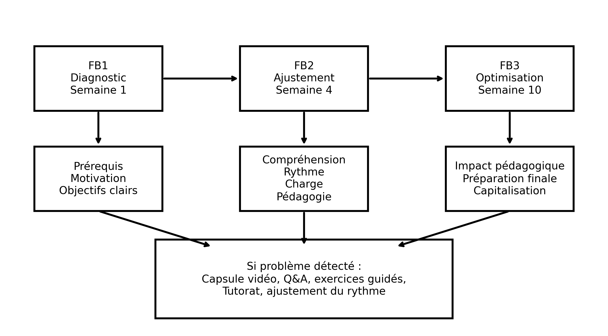
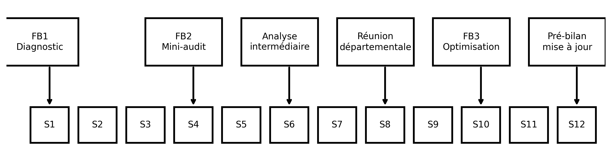
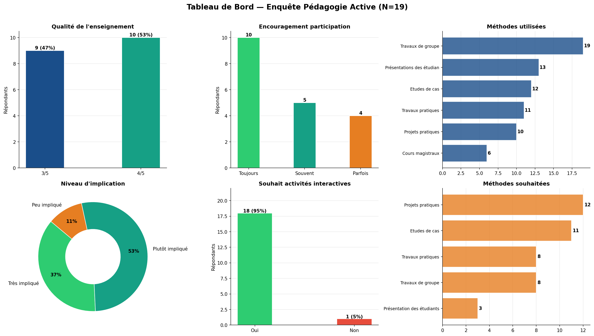

```{python}
#| echo: false
import pandas as pd
from pathlib import Path
from html import escape

ROOT = Path("..").resolve()
df_ens = pd.read_csv("../data/enseignements_detailed.csv")
df_sup = pd.read_csv("../data/supports.csv")

# Nettoyage
df_ens["anglais"] = df_ens["anglais"].astype(str).str.lower().map(
    {"true": True, "false": False, "yes": True, "no": False}
).fillna(False)
df_ens["coordinateur"] = df_ens["coordinateur"].astype(str).str.lower().map(
    {"true": True, "false": False, "yes": True, "no": False}
).fillna(False)
df_ens["nouveau_module"] = df_ens["nouveau_module"].astype(str).str.lower().map(
    {"true": True, "false": False, "yes": True, "no": False}
).fillna(False)

DOMAINS = [
    ("Mathématiques et Statistiques", "∫", "Algèbre, Analyse, Probabilités, Statistiques inférentielles, GLM, Logique, Recherche Opérationnelle"),
    ("Intelligence Artificielle", '<i class="bi bi-robot"></i>', "Machine Learning, Deep Learning, NLP, Generative Computer Vision, Outillage ML"),
    ("Sciences des données", '<i class="bi bi-bar-chart-line"></i>', "Analyse des données, Data Mining, Programmation R/Python, Séries temporelles"),
    ("Encadrement et soutien", '<i class="bi bi-bullseye"></i>', "Cours de soutien, Atelier Python, Gestion de projet"),
]
```

::: {.panel-tabset}

## Présentation générale

### Ma vision

::: {.vision-card}
Mon enseignement s'appuie sur une articulation entre **rigueur scientifique**,
**applications concrètes** et **apprentissage progressif par la pratique**.
J'accorde une importance particulière à la compréhension des concepts
fondamentaux, à leur mise en œuvre sur des cas réels et au développement
de l'autonomie des étudiants. Cette démarche est pilotée par un
**système de feedback continu** en trois temps — diagnostic, ajustement,
optimisation — qui permet d'adapter le cours *pendant* le semestre plutôt
que d'en constater les limites à son terme *(voir l'onglet Feedback continu)*.
:::

### Domaines d'enseignement

```{python}
#| echo: false
#| output: asis

cards = ['<div class="domain-grid">']
for d, icon, _ in DOMAINS:
    n_modules = df_ens[df_ens["domaine"] == d]["nom_module"].nunique()
    cards.append(f'''
    <div class="domain-card" data-domain="{d}">
      <div class="domain-icon">{icon}</div>
      <div class="domain-name">{d}</div>
      <div class="domain-count">{n_modules} module{'s' if n_modules > 1 else ''}</div>
    </div>''')
cards.append('</div>')
print('\n'.join(cards))
```

### Récapitulatif des enseignements

```{python}
#| echo: false
#| output: asis

# Pour chaque domaine : un accordéon avec un tableau filtrable

YES_NO = lambda b: "Oui" if b else "Non"

def render_table(d_df, table_id):
    """Génère un tableau HTML avec filtres JavaScript natif."""
    annees = sorted(d_df["annee"].dropna().unique().tolist(), reverse=True)
    niveaux = sorted(d_df["niveau"].dropna().unique().tolist())
    ecoles = sorted(d_df["ecole"].dropna().unique().tolist())

    # Filtres
    filters = f'''
<div class="teaching-filters">
  <label>Recherche :</label>
  <input type="text" id="{table_id}-search" placeholder="nom du module..." oninput="filterTeaching('{table_id}')">
  <label>Année :</label>
  <select id="{table_id}-annee" onchange="filterTeaching('{table_id}')">
    <option value="">Toutes</option>
    {''.join(f'<option value="{a}">{a}</option>' for a in annees)}
  </select>
  <label>Niveau :</label>
  <select id="{table_id}-niveau" onchange="filterTeaching('{table_id}')">
    <option value="">Tous</option>
    {''.join(f'<option value="{n}">{n}</option>' for n in niveaux)}
  </select>
  <label>École :</label>
  <select id="{table_id}-ecole" onchange="filterTeaching('{table_id}')">
    <option value="">Toutes</option>
    {''.join(f'<option value="{e}">{e}</option>' for e in ecoles)}
  </select>
  <label>Langue :</label>
  <select id="{table_id}-langue" onchange="filterTeaching('{table_id}')">
    <option value="">Toutes</option>
    <option value="EN">Anglais</option>
    <option value="FR">Français</option>
  </select>
</div>'''

    rows = []
    for _, r in d_df.iterrows():
        lang = "EN" if r["anglais"] else "FR"
        new_badge = ' <span class="status-badge status-disponible" style="font-size:0.7rem">NOUVEAU</span>' if r["nouveau_module"] else ''
        coord_check = "✓" if r["coordinateur"] else ""
        nouveau_check = "✓" if r["nouveau_module"] else ""
        # Icône GitHub si lien dispo (peut contenir plusieurs URLs séparées par |)
        liens = str(r.get("lien_github") or "").strip()
        gh_icons = ""
        if liens and liens.lower() != "nan":
            urls = [u.strip() for u in liens.split("|") if u.strip()]
            for u in urls:
                gh_icons += f' <a href="{escape(u)}" target="_blank" title="{escape(u)}" style="color:#24292f;text-decoration:none"><i class="bi bi-github"></i></a>'
        rows.append(f'''
<tr data-annee="{escape(str(r["annee"]))}" data-niveau="{escape(str(r["niveau"]))}" data-ecole="{escape(str(r["ecole"]))}" data-langue="{lang}" data-module="{escape(str(r["nom_module"]).lower())}">
  <td>{escape(str(r["annee"]))}</td>
  <td><strong>{escape(str(r["nom_module"]))}</strong>{new_badge}{gh_icons}</td>
  <td>{escape(str(r["niveau"]))}</td>
  <td>{escape(str(r["classe"]))}</td>
  <td style="text-align:center">{escape(str(r["nb_groupes"]))}</td>
  <td style="text-align:center">{lang}</td>
  <td style="text-align:center">{escape(str(r["charge_horaire"]))} h</td>
  <td style="text-align:center">{coord_check}</td>
  <td style="text-align:center">{nouveau_check}</td>
  <td>{escape(str(r["ecole"]))}</td>
</tr>''')

    table = f'''
<div class="table-responsive">
<table id="{table_id}" class="table table-sm table-hover">
  <thead>
    <tr>
      <th>Année</th><th>Module</th><th>Niveau</th><th>Classe</th>
      <th>Groupes</th><th>EN</th><th>Charge</th><th>Coord.</th><th>Nouveau</th><th>École</th>
    </tr>
  </thead>
  <tbody>{''.join(rows)}</tbody>
</table>
</div>'''
    return filters + table


parts = []
for d, icon, desc in DOMAINS:
    d_df = df_ens[df_ens["domaine"] == d]
    if d_df.empty:
        continue
    table_id = f"tbl-{d.lower().replace(' ', '-').replace('&', 'et').replace('é', 'e').replace('è', 'e')}"
    n_lignes = len(d_df)
    n_modules = d_df["nom_module"].nunique()

    table_html = render_table(d_df, table_id)
    parts.append(f'''
<details class="callout callout-style-default callout-titled" style="margin: 1rem 0;">
  <summary class="callout-header" style="cursor:pointer; padding: 0.8rem 1rem; background:#FAFAFA; border-left: 4px solid #C8102E; font-weight:600;">
    {icon}&nbsp; <strong>{d}</strong>&nbsp; <span style="color:#666; font-weight:400; font-size:0.9em">— {n_modules} module(s) · {n_lignes} ligne(s) · {desc}</span>
  </summary>
  <div class="callout-body" style="padding: 0.8rem 1rem 1.2rem;">
    {table_html}
  </div>
</details>''')

print('\n'.join(parts))
```

```{=html}
<script>
function filterTeaching(tableId) {
  const search = document.getElementById(tableId + '-search').value.toLowerCase();
  const annee = document.getElementById(tableId + '-annee').value;
  const niveau = document.getElementById(tableId + '-niveau').value;
  const ecole = document.getElementById(tableId + '-ecole').value;
  const langue = document.getElementById(tableId + '-langue').value;
  const rows = document.querySelectorAll('#' + tableId + ' tbody tr');
  rows.forEach(r => {
    const m = r.dataset.module || '';
    const a = r.dataset.annee || '';
    const n = r.dataset.niveau || '';
    const e = r.dataset.ecole || '';
    const l = r.dataset.langue || '';
    const matchSearch = !search || m.includes(search);
    const matchAnnee = !annee || a === annee;
    const matchNiveau = !niveau || n === niveau;
    const matchEcole = !ecole || e === ecole;
    const matchLangue = !langue || l === langue;
    r.style.display = (matchSearch && matchAnnee && matchNiveau && matchEcole && matchLangue) ? '' : 'none';
  });
}
</script>
```

## Feedback continu

### Ma vision du feedback continu

::: {.vision-card}
Je considère le feedback non pas comme une évaluation ponctuelle de fin de
semestre, mais comme un **instrument de pilotage pédagogique en temps réel**.
Mon système de feedback continu repose sur **trois mesures structurées** —
**FB1 Diagnostic** (semaine 1), **FB2 Ajustement** (semaine 4) et
**FB3 Optimisation** (semaine 10) — couplées à des **seuils déclencheurs
quantifiés** et à des **actions correctives rapides** tracées dans une fiche
dédiée (fiche ARC). L'objectif : détecter tôt les difficultés de
compréhension, d'engagement ou de rythme, agir dans les deux semaines, et
capitaliser chaque semestre dans le syllabus et la fiche module.
:::

::: {.grid}
::: {.g-col-md-4 .g-col-12}
::: {.kpi style="width:100%; min-width:0;"}
[FB1 · Diagnostic — Semaine 1]{.label}
[[]{.bi .bi-search}]{.value style="font-size:2rem"}
[Prérequis · Motivation · Objectifs clairs]{.label}
:::
:::
::: {.g-col-md-4 .g-col-12}
::: {.kpi style="width:100%; min-width:0;"}
[FB2 · Ajustement — Semaine 4]{.label}
[[]{.bi .bi-sliders}]{.value style="font-size:2rem"}
[Compréhension · Rythme · Charge · Pédagogie]{.label}
:::
:::
::: {.g-col-md-4 .g-col-12}
::: {.kpi style="width:100%; min-width:0;"}
[FB3 · Optimisation — Semaine 10]{.label}
[[]{.bi .bi-rocket-takeoff}]{.value style="font-size:2rem"}
[Impact · Préparation finale · Capitalisation]{.label}
:::
:::
:::

{fig-align="center" width="85%"}

### Le dispositif sur un semestre (12 semaines)

{fig-align="center"}

| Moment | Outil | Action possible |
|:---|:---|:---|
| **Semaine 1** | Observation de l'enseignant · **Feedback 1** (prérequis et motivations) | Ajuster le rythme |
| **Semaine 4** | Mini audit pédagogique · **Feedback 2** sur Blackboard | Coaching enseignant · Fiche ARC |
| **Semaine 6** | Analyse des résultats intermédiaires (DS, mini-projet, taux d'engagement) avec le coordinateur du module | Séance de renforcement |
| **Semaine 8** | Réunion départementale | Adapter le contenu · Ajuster la méthode |
| **Semaine 10** | **Feedback 3** · Discussion avec les étudiants · LMS analytics | Corrections finales · Fiche ARC |
| **Semaine 12** | Pré-bilan | Mise à jour du syllabus / fiche module |

: {tbl-colwidths="[15,55,30]"}

### Boucles d'action correctives

Chaque problème détecté déclenche une réponse type dans les deux semaines :

| Problème détecté | Déclencheurs | Actions immédiates |
|:---|:---|:---|
| **Compréhension** | < 60 % de réussite aux quiz · feedback « cours difficile » · baisse de participation | Capsule vidéo résumé · séance Q&A supplémentaire · exercices guidés · peer tutoring étudiants forts/faibles |
| **Engagement** | Absences en hausse · faible activité Blackboard · peu d'interaction en classe | Activité interactive dès la séance suivante · quiz live · mini-projet court · gamification simple |
| **Rythme / surcharge** | Feedback « charge élevée » · retards de remise des devoirs | Re-planifier les deadlines · fractionner le projet · fournir un template / exemple |
| **Pédagogie enseignant** | Feedback répété des étudiants · score d'observation pédagogique faible | Coaching pédagogique rapide · co-animation de séance · partage de bonnes pratiques |

: {tbl-colwidths="[20,38,42]"}

### Résultats de l'enquête pédagogie active (mars 2026)

::: {.callout-note appearance="simple"}
**Questionnaire anonyme sur les méthodes d'apprentissage** — 10 questions,
**19 répondants**, mars 2026. Cette enquête ferme la boucle du feedback
continu : elle mesure la perception des méthodes actives par les étudiants
et oriente les actions correctives du semestre suivant.
Rapport complet : **[[]{.bi .bi-file-earmark-pdf} Enquête Pédagogie Active (PDF)](../documents/enquete-pedagogie-active.pdf)**
:::

::: {.grid}
::: {.g-col-md-3 .g-col-sm-6 .g-col-12}
::: {.kpi style="width:100%; min-width:0;"}
[3,5 / 5]{.value}
[Satisfaction globale (aucune note ≤ 2)]{.label}
:::
:::
::: {.g-col-md-3 .g-col-sm-6 .g-col-12}
::: {.kpi style="width:100%; min-width:0;"}
[95 %]{.value}
[souhaitent plus d'activités interactives]{.label}
:::
:::
::: {.g-col-md-3 .g-col-sm-6 .g-col-12}
::: {.kpi style="width:100%; min-width:0;"}
[89 %]{.value}
[se sentent impliqués dans leur apprentissage]{.label}
:::
:::
::: {.g-col-md-3 .g-col-sm-6 .g-col-12}
::: {.kpi style="width:100%; min-width:0;"}
[100 %]{.value}
[exposés aux travaux de groupe]{.label}
:::
:::
:::

{fig-align="center"}

::: {.grid}
::: {.g-col-md-6 .g-col-12}
::: {.callout-tip title="Points forts" appearance="simple"}
- Méthodes actives déjà bien installées (travaux de groupe : **100 %**)
- Participation encouragée par la majorité des enseignants (**79 %** « toujours » ou « souvent »)
- **89 %** des étudiants se sentent impliqués dans leur apprentissage
- Liaison théorie → pratique présente pour **85 %** des répondants
:::
:::
::: {.g-col-md-6 .g-col-12}
::: {.callout-warning title="Axes d'amélioration retenus" appearance="simple"}
- **95 %** demandent plus d'interactivité → priorité n°1
- Renforcer projets pratiques et études de cas réels (≥ 60 % le souhaitent)
- Réduire le nombre de présentations étudiantes (saturation signalée)
- Orienter les examens vers la réflexion plutôt que la mémorisation
- Renforcer les outils professionnels (Python, Power BI, Oracle…)
:::
:::
:::

::: {.callout-tip collapse="true" title="Détail des résultats question par question"}
| # | Question | Résultat clé |
|:--|:---|:---|
| Q1 | Qualité globale de l'enseignement | 3,5/5 en moyenne — notes 3 et 4 uniquement, aucun extrême |
| Q2 | Encouragement à la participation | 79 % « toujours » ou « souvent » |
| Q3 | Méthodes utilisées | Travaux de groupe 100 % · présentations 68 % · études de cas 63 % · cours magistraux 32 % |
| Q4 | Méthodes jugées les plus efficaces | Travaux pratiques 74 % · études de cas 58 % · cours magistraux derniers (21 %) |
| Q5 | Application théorie → pratique | 85 % « souvent » ou « toujours » |
| Q6 | Encouragement à la réflexion | 89 % « assez » ou « beaucoup » — marge de progrès sur la pensée critique |
| Q7 | Implication active en cours | 89 % impliqués · aucun « pas du tout impliqué » |
| Q8 | Souhait de plus d'interactivité | **Oui : 95 %** — variable la plus consensuelle |
| Q9 | Méthodes souhaitées davantage | Projets pratiques 63 % · études de cas 58 % · présentations 16 % |
| Q10 | Amélioration prioritaire (question ouverte) | Pratique & cas réels (11 rép.) · qualité > quantité · alignement marché du travail |

: {tbl-colwidths="[8,40,52]"}
:::

### Mes annexes de feedback

::: {.callout-note appearance="simple"}
Les quatre annexes ci-dessous constituent l'outillage opérationnel du
système. Le document complet est téléchargeable :
**[[]{.bi .bi-file-earmark-pdf} Système de feedback continu — document intégral avec annexes (PDF)](../documents/systeme-feedback-continu.pdf)**
:::

::: {.callout-tip collapse="true" title="Annexe 1 — Fiche Action Corrective Rapide (fiche ARC)"}
Template de traçabilité de chaque action corrective, garantissant le suivi
et la mesure d'impact :

- **Module** / **Enseignant** / **Semaine**
- **Problème détecté** et **source** (feedback, quiz, observation)
- **Action décidée** et **date de mise en place**
- **Résultat après 2 semaines**
- **Responsable du suivi**
:::

::: {.callout-tip collapse="true" title="Annexe 2 — Feedback 1 · Diagnostic (semaine 1)"}
Questionnaire de 8–10 questions rempli par l'étudiant, accès réservé aux
présents de la première séance.

**Objectifs** : vérifier les prérequis réels · mesurer la motivation
initiale · vérifier la compréhension des objectifs du module.

**Structure** : Bloc A — prérequis académiques (auto-évaluation, difficultés,
besoin de rappels) · Bloc B — motivation et engagement (échelles 1→5) ·
Bloc C — clarté des objectifs et des attentes · Bloc D — projection
(confiance de réussite, « ce qui pourrait m'aider le plus »).

**Déclencheurs d'action** : prérequis faibles > 25 % · motivation < 3,5 ·
objectifs clairs < 3.
:::

::: {.callout-tip collapse="true" title="Annexe 3 — Feedback 2 · Ajustement (semaine 4)"}
Questionnaire de 8–10 questions sur Blackboard, accès réservé aux étudiants
avec un taux de présence > 50 %.

**Objectifs** : vérifier la compréhension réelle · ajuster le rythme et la
pédagogie · confirmer ou corriger le diagnostic des prérequis.

**Structure** : Bloc A — compréhension du contenu et principal obstacle ·
Bloc B — rythme et charge de travail · Bloc C — pédagogie (clarté des
explications, utilité des supports) · Bloc D — suivi de l'évolution des
prérequis · Bloc E — « quelle amélioration immédiate aiderait le plus ? ».

**Déclencheurs d'action** : compréhension < 3,5 · rythme « trop rapide »
> 30 % · problème de prérequis persistant.
:::

::: {.callout-tip collapse="true" title="Annexe 4 — Feedback 3 · Optimisation (semaine 10)"}
Questionnaire de 10–12 questions, accès réservé aux étudiants avec un taux
de présence > 50 %.

**Objectifs** : mesurer l'impact pédagogique réel · vérifier la préparation
à l'évaluation finale · capitaliser pour l'amélioration future.

**Structure** : Bloc A — acquisition des compétences et sentiment de
préparation · Bloc B — méthodes pédagogiques (activité la plus utile :
cours, TD/TP, projet, études de cas, quiz) · Bloc C — engagement et
motivation à approfondir.

Les résultats alimentent les **corrections finales**, la **fiche ARC** et le
**pré-bilan de semaine 12** (mise à jour du syllabus et de la fiche module).
:::

## Évolution des modules

```{python}
#| echo: false
#| output: asis
import plotly.express as px
import plotly.graph_objects as go
from plotly.io import to_html

# --- Données dérivées ---
df_evo = df_ens.copy()

# Année de fin = "2025-2026" -> 2026 (numérique pour les axes)
def annee_fin(s):
    s = str(s)
    if "-" in s:
        try:
            return int(s.split("-")[1])
        except Exception:
            return None
    return None

df_evo["annee_num"] = df_evo["annee"].apply(annee_fin)

# KPIs
n_lignes = len(df_evo)
n_modules = df_evo["nom_module"].nunique()
n_annees = df_evo["annee"].nunique()
n_heures = int(df_evo["charge_horaire"].sum())
n_nouveaux = int(df_evo["nouveau_module"].sum())
n_anglais = int(df_evo["anglais"].sum())

kpi_html = f'''
<div class="domain-grid" style="margin: 1rem 0;">
  <div class="domain-card"><div class="domain-icon"><i class="bi bi-stopwatch"></i></div><div class="domain-name">{n_heures:,}</div><div class="domain-count">Heures cumulées</div></div>
  <div class="domain-card"><div class="domain-icon"><i class="bi bi-collection"></i></div><div class="domain-name">{n_modules}</div><div class="domain-count">Modules distincts</div></div>
  <div class="domain-card"><div class="domain-icon">📅</div><div class="domain-name">{n_annees}</div><div class="domain-count">Années actives</div></div>
  <div class="domain-card"><div class="domain-icon">🆕</div><div class="domain-name">{n_nouveaux}</div><div class="domain-count">Nouveau module (lignes)</div></div>
  <div class="domain-card"><div class="domain-icon">🇬🇧</div><div class="domain-name">{n_anglais}</div><div class="domain-count">Cours en anglais</div></div>
</div>
'''.replace(",", " ")
print(kpi_html)
```

### Heures par année et par domaine

```{python}
#| echo: false

# Bar chart empilé : charge horaire par année par domaine
agg = df_evo.groupby(["annee", "domaine"], as_index=False)["charge_horaire"].sum()
fig1 = px.bar(
    agg.sort_values("annee"),
    x="annee", y="charge_horaire", color="domaine",
    labels={"annee": "Année universitaire", "charge_horaire": "Heures", "domaine": "Domaine"},
    color_discrete_sequence=px.colors.qualitative.Set2,
    height=420,
)
fig1.update_layout(
    barmode="stack",
    legend=dict(orientation="h", yanchor="bottom", y=-0.45, xanchor="center", x=0.5),
    margin=dict(l=10, r=10, t=20, b=10),
    plot_bgcolor="white",
)
fig1.update_xaxes(tickangle=-30)
fig1.show()
```

### Évolution du nombre de modules dispensés

```{python}
#| echo: false

# Lignes : nombre de modules différents par année + cumul des nouveaux modules
per_year = (df_evo.groupby("annee", as_index=False)
                  .agg(modules_differents=("nom_module", "nunique"),
                       nouveaux=("nouveau_module", "sum"))
                  .sort_values("annee"))
per_year["cumul_nouveaux"] = per_year["nouveaux"].cumsum()

fig2 = go.Figure()
fig2.add_trace(go.Bar(
    x=per_year["annee"], y=per_year["nouveaux"],
    name="Nouveaux modules (année)", marker_color="#C8102E",
))
fig2.add_trace(go.Scatter(
    x=per_year["annee"], y=per_year["modules_differents"],
    mode="lines+markers", name="Modules différents (année)",
    line=dict(color="#2C3E50", width=3),
))
fig2.add_trace(go.Scatter(
    x=per_year["annee"], y=per_year["cumul_nouveaux"],
    mode="lines+markers", name="Cumul des nouveaux modules",
    line=dict(color="#F39C12", width=2, dash="dash"),
))
fig2.update_layout(
    height=420,
    xaxis_title="Année universitaire",
    yaxis_title="Nombre de modules",
    legend=dict(orientation="h", yanchor="bottom", y=-0.30, xanchor="center", x=0.5),
    margin=dict(l=10, r=10, t=20, b=10),
    plot_bgcolor="white",
)
fig2.update_xaxes(tickangle=-30)
fig2.show()
```

### Heatmap module × année (charge horaire)

```{python}
#| echo: false

# Pivot : modules en lignes, années en colonnes, valeurs = somme des heures
pivot = (df_evo.pivot_table(
    index="nom_module", columns="annee",
    values="charge_horaire", aggfunc="sum", fill_value=0,
))

# Trier les modules par année de première apparition (chronologique)
def first_year(row):
    nz = row[row > 0]
    return nz.index.min() if len(nz) else "9999"
pivot["_first"] = pivot.apply(first_year, axis=1)
pivot = pivot.sort_values("_first").drop(columns="_first")

fig3 = px.imshow(
    pivot.values,
    x=list(pivot.columns),
    y=list(pivot.index),
    color_continuous_scale=[(0, "#FFFFFF"), (0.01, "#FDE2E4"), (1, "#C8102E")],
    aspect="auto",
    labels=dict(x="Année universitaire", y="Module", color="Heures"),
    height=max(420, 18 * len(pivot)),
)
fig3.update_layout(
    margin=dict(l=10, r=10, t=20, b=10),
    coloraxis_colorbar=dict(title="Heures"),
)
fig3.update_xaxes(side="top", tickangle=-30)
fig3.show()
```

### Timeline d'enseignement par module

```{python}
#| echo: false

# Pour chaque module : année de début et fin (en année calendaire de fin d'année univ.)
def to_period(s):
    s = str(s)
    if "-" in s:
        a, b = s.split("-")
        try:
            return int(a), int(b)
        except Exception:
            return None, None
    return None, None

mod_span = []
for mod, g in df_evo.groupby("nom_module"):
    starts = [to_period(a)[0] for a in g["annee"]]
    ends = [to_period(a)[1] for a in g["annee"]]
    starts = [s for s in starts if s is not None]
    ends = [e for e in ends if e is not None]
    if not starts or not ends:
        continue
    mod_span.append({
        "module": mod,
        "domaine": g["domaine"].iloc[0],
        "debut": f"{min(starts)}-09-01",
        "fin": f"{max(ends)}-06-30",
        "nb_annees": g["annee"].nunique(),
        "heures_total": int(g["charge_horaire"].sum()),
        "niveau": ", ".join(sorted(g["niveau"].dropna().unique())),
    })
mod_span = pd.DataFrame(mod_span).sort_values("debut")

fig4 = px.timeline(
    mod_span,
    x_start="debut", x_end="fin", y="module",
    color="domaine",
    color_discrete_sequence=px.colors.qualitative.Set2,
    hover_data={"nb_annees": True, "heures_total": True, "niveau": True,
                "debut": False, "fin": False},
    height=max(420, 22 * len(mod_span)),
)
fig4.update_yaxes(autorange="reversed", title=None)
fig4.update_layout(
    xaxis_title="Période d'enseignement",
    legend=dict(orientation="h", yanchor="bottom", y=-0.10, xanchor="center", x=0.5),
    margin=dict(l=10, r=10, t=20, b=10),
    plot_bgcolor="white",
)
fig4.show()
```

### Nouveaux modules par année universitaire

```{python}
#| echo: false
#| output: asis

# Pour chaque année : liste des modules marqués "Nouveau Module"
nouveaux = (df_evo[df_evo["nouveau_module"]]
            .groupby("annee")
            .apply(lambda g: ", ".join(sorted(g["nom_module"].unique())))
            .reset_index(name="modules"))

rows = []
for _, r in nouveaux.iterrows():
    rows.append(f'''
<tr>
  <td><strong>{escape(str(r["annee"]))}</strong></td>
  <td>{escape(str(r["modules"]))}</td>
</tr>''')

print(f'''
<div class="table-responsive">
<table class="table table-sm table-hover">
  <thead>
    <tr><th style="width:140px">Année</th><th>Modules nouveaux ou refondus</th></tr>
  </thead>
  <tbody>{''.join(rows)}</tbody>
</table>
</div>
''')
```

## Supports des cours

```{python}
#| echo: false
#| output: asis
import re
import unicodedata

# Slugify pour lier vers enseignements/modules/<slug>.qmd
def _slugify(s):
    s = unicodedata.normalize("NFD", s)
    s = "".join(c for c in s if unicodedata.category(c) != "Mn")
    s = s.lower()
    return re.sub(r"[^a-z0-9]+", "-", s).strip("-")

# Pages détaillées existantes (dans enseignements/<slug>.qmd)
# Slugs alignés sur ceux du catalogue
DETAILED_PAGES = {
    "Algèbre 2": "algebre-2",
    "Algèbre 3": "algebre-3",
    "Probabilités": "probabilites",
    "Analyse 4": "analyse-4",
    "Recherche Opérationnelle": "recherche-operationnelle",
    "Machine Learning": "machine-learning",
    "Deep Learning": "deep-learning",
    "Generative Computer Vision": "generative-computer-vision",
    "Programmation Python 2": "python-programming",
    "Programmation Python 3": "python-programming",
    "Outillage Machine Learning": "outillage-machine-learning",
}

def status_class(s):
    s = (s or "").lower()
    if "disponible" in s and "réservé" not in s:
        return "status-disponible"
    if "à venir" in s or "venir" in s:
        return "status-a-venir"
    return "status-reserve"

def render_resource_button(name, status, link):
    s = (status or "").lower()
    if "à venir" in s or not link or link == "" or link == "#":
        return '<span class="resource-btn btn-disabled">Indisponible</span>'
    if "réservé" in s:
        return '<span class="resource-btn btn-disabled">Accès restreint</span>'
    if name.lower() == "slides":
        return f'<a href="{escape(link)}" class="resource-btn btn-view">Voir</a>'
    return f'<a href="{escape(link)}" class="resource-btn btn-download">Télécharger</a>'

def parse_links(s):
    if not s or str(s).lower() == "nan":
        return []
    return [u.strip() for u in str(s).split("|") if u.strip()]

# Colonne lien_github depuis enseignements_detailed.csv
df_ens["lien_github"] = df_ens.get("lien_github", "").astype(str).replace("nan", "")

parts = []
for d, icon, desc in DOMAINS:
    # Tous les modules du domaine, dédupliqués (un module peut être dispensé plusieurs années)
    d_df = df_ens[df_ens["domaine"] == d]
    if d_df.empty:
        continue

    # Agrégation par module
    modules_in_domain = []
    for mod, g in d_df.groupby("nom_module"):
        niveaux = ", ".join(sorted(g["niveau"].dropna().unique()))
        classes = ", ".join(sorted(c for c in g["classe"].dropna().unique() if c and c != "—"))
        heures_total = int(g["charge_horaire"].sum())
        nb_annees = g["annee"].nunique()
        # Liens GitHub (peuvent être plusieurs séparés par |)
        gh_set = []
        for v in g["lien_github"].dropna().unique():
            for u in parse_links(v):
                if u and u not in gh_set:
                    gh_set.append(u)
        modules_in_domain.append({
            "module": mod,
            "niveaux": niveaux,
            "classes": classes,
            "heures": heures_total,
            "nb_annees": nb_annees,
            "github": gh_set,
        })

    # Tri : modules avec GitHub d'abord, puis par charge décroissante
    modules_in_domain.sort(key=lambda m: (-len(m["github"]), -m["heures"], m["module"]))

    n_modules = len(modules_in_domain)
    n_with_gh = sum(1 for m in modules_in_domain if m["github"])

    cards = []
    for m in modules_in_domain:
        # Boutons d'action en haut de la carte
        actions = []
        slug_factsheet = _slugify(m["module"])
        actions.append(
            f'<a href="modules/{slug_factsheet}.html" class="resource-btn btn-view" title="Fiche module">📋 Fiche</a>'
        )
        # Page pédagogique détaillée si existante
        if m["module"] in DETAILED_PAGES:
            actions.append(
                f'<a href="{DETAILED_PAGES[m["module"]]}.html" class="resource-btn btn-view" title="Page pédagogique détaillée">📖 Pédagogique</a>'
            )
        # GitHub repos
        for url in m["github"]:
            short = url.replace("https://github.com/", "").rstrip("/")
            actions.append(
                f'<a href="{escape(url)}" target="_blank" class="resource-btn btn-download" title="{escape(url)}"><i class="bi bi-github"></i> {escape(short)}</a>'
            )

        # Supports détaillés depuis supports.csv (match par nom_module insensible à la casse)
        rows_html = []
        sup_match = df_sup[df_sup["nom_module"].str.lower() == m["module"].lower()]
        for _, r in sup_match.iterrows():
            badge = status_class(r["ressource_statut"])
            btn = render_resource_button(r["ressource_nom"], r["ressource_statut"], r.get("ressource_lien", ""))
            rows_html.append(f'''
<div class="resource-row">
  <span class="resource-name">{escape(r["ressource_nom"])}</span>
  <span class="status-badge {badge}">{escape(r["ressource_statut"])}</span>
  {btn}
</div>''')

        actions_html = " ".join(actions)
        meta_extra = f"{m['heures']} h · {m['nb_annees']} an(s)"
        cards.append(f'''
<div class="module-card">
  <h4 class="module-title">{escape(m["module"])}</h4>
  <div class="module-meta">
    <span>{escape(m["niveaux"]) or "—"}</span>
    <span>{escape(m["classes"]) or "—"}</span>
    <span>{meta_extra}</span>
  </div>
  <div class="resources" style="display:flex;flex-wrap:wrap;gap:0.4rem;margin-bottom:0.5rem">
    {actions_html}
  </div>
  {('<div class="resources">' + "".join(rows_html) + "</div>") if rows_html else ""}
</div>''')

    parts.append(f'''
<details class="callout" open style="margin: 1rem 0;">
  <summary style="cursor:pointer; padding: 0.8rem 1rem; background:#FAFAFA; border-left: 4px solid #C8102E; font-weight:600;">
    {icon}&nbsp; <strong>{d}</strong>&nbsp; <span style="color:#666; font-weight:400; font-size:0.9em">— {n_modules} module(s) · {n_with_gh} avec repository GitHub</span>
  </summary>
  <div style="padding: 1rem;">
    {''.join(cards)}
  </div>
</details>''')

print('\n'.join(parts))
```

:::

---

## Maintenir ces données

Les enseignements et supports sont alimentés par 2 fichiers CSV :

| Fichier | Schéma |
|---|---|
| `data/enseignements_detailed.csv` | `domaine, annee, nom_module, niveau, classe, nb_groupes, anglais, charge_horaire, coordinateur, nouveau_module, ecole` |
| `data/supports.csv` | `domaine, nom_module, niveau, classe, ecole, ressource_nom, ressource_statut, ressource_lien` |

Pour ajouter ou modifier un enseignement / support : éditer le CSV (Excel,
VS Code...), `quarto render`, et la page se met à jour automatiquement.
